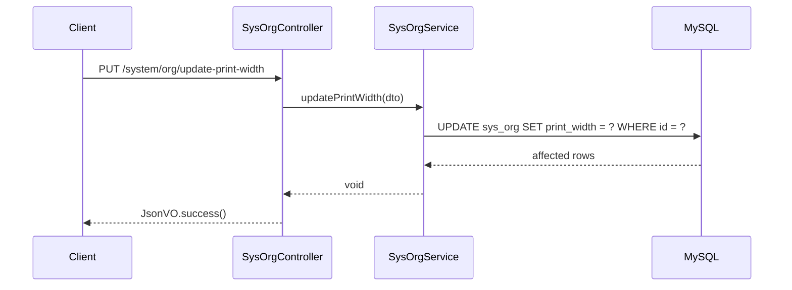

# Design Document

## Overview

为门店（SysOrg）实体添加"打印宽度"（printWidth）字段，用于配置门店小票打印的纸张宽度。该功能包括：
1. 在SysOrg实体中添加printWidth字段，类型为Integer，默认值58
2. 提供独立的API接口用于修改门店的打印宽度配置

## Architecture

本功能遵循现有项目的三层架构：
- **pos-common**: 添加DTO类用于接收打印宽度更新请求
- **pos-server**: 在SysOrg实体中添加字段，Service层添加更新方法
- **pos-web**: 在SysOrgController中添加更新打印宽度的API接口



## Components and Interfaces

### 1. DTO - OrgPrintWidthUpdateDTO

位置：`pos-common/src/main/java/org/haut/common/domain/dto/system/OrgPrintWidthUpdateDTO.java`

```java
@Data
@Schema(description = "门店打印宽度更新对象")
public class OrgPrintWidthUpdateDTO {
    @Schema(description = "门店ID")
    @NotNull(message = "门店ID不能为空")
    private Long id;

    @Schema(description = "打印宽度（毫米）", example = "58")
    @NotNull(message = "打印宽度不能为空")
    private Integer printWidth;
}
```

### 2. Entity - SysOrg

位置：`pos-server/src/main/java/org/haut/server/system/entity/SysOrg.java`

新增字段：
```java
/**
 * 打印宽度（毫米），默认58
 */
private Integer printWidth;
```

### 3. VO - OrgInfoVO

位置：`pos-common/src/main/java/org/haut/common/domain/vo/system/OrgInfoVO.java`

新增字段：
```java
@Schema(description = "打印宽度（毫米）")
private Integer printWidth;
```

### 4. Service - SysOrgService

位置：`pos-server/src/main/java/org/haut/server/system/service/SysOrgService.java`

新增方法：
```java
void updatePrintWidth(OrgPrintWidthUpdateDTO dto);
```

### 5. Controller - SysOrgController

位置：`pos-web/src/main/java/org/haut/controller/system/SysOrgController.java`

新增接口：
```java
@PutMapping("/update-print-width")
@Operation(description = "修改门店打印宽度", summary = "修改门店打印宽度")
public JsonVO<String> updatePrintWidth(@RequestBody @Validated OrgPrintWidthUpdateDTO dto)
```

## Data Models

### 数据库变更

表：`sys_org`

| 字段名 | 类型 | 默认值 | 说明 |
|--------|------|--------|------|
| print_width | INT | 58 | 打印宽度（毫米） |

SQL变更脚本：
```sql
ALTER TABLE sys_org ADD COLUMN print_width INT DEFAULT 58 COMMENT '打印宽度（毫米）';
```

## Correctness Properties

*A property is a characteristic or behavior that should hold true across all valid executions of a system-essentially, a formal statement about what the system should do. Properties serve as the bridge between human-readable specifications and machine-verifiable correctness guarantees.*

基于prework分析，本功能的可测试属性如下：

Property 1: 打印宽度更新round-trip一致性
*For any* 有效的门店ID和打印宽度值，更新打印宽度后查询该门店，返回的打印宽度应等于更新时设置的值。
**Validates: Requirements 2.1**

## Error Handling

| 场景 | 错误处理 |
|------|----------|
| 门店ID不存在 | 抛出BusinessException，返回"门店不存在"错误信息 |
| 打印宽度为空 | 通过@NotNull验证，返回"打印宽度不能为空"错误信息 |
| 门店ID为空 | 通过@NotNull验证，返回"门店ID不能为空"错误信息 |

## Testing Strategy

### 单元测试

由于本功能较为简单，主要涉及字段添加和简单的CRUD操作，单元测试覆盖：
- Service层updatePrintWidth方法的正常更新逻辑
- 门店不存在时的异常处理

### 属性测试

使用JUnit 5进行测试，验证：
- Property 1: 更新打印宽度后查询返回一致的值

### 集成测试

- API接口测试：验证PUT /system/org/update-print-width接口的请求响应
